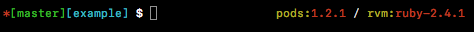

# Oh My Zsh Theme for Cocoapods

Displays at the right side of the terminal the current Cocoapods and the Ruby (via RVM) version. Its _only_ active if a `Podfile` is in the current directory

At the left side it shows the current git branch and the current directory name. 

## Installation

Move `messeb.zsh-theme` to `~/.oh-my-zsh/custom/themes` and restart the terminal

## License

Theme is released under the [MIT license](LICENSE.txt).